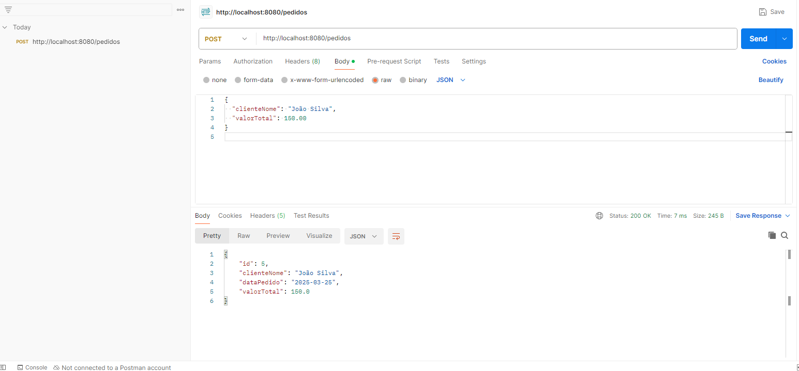
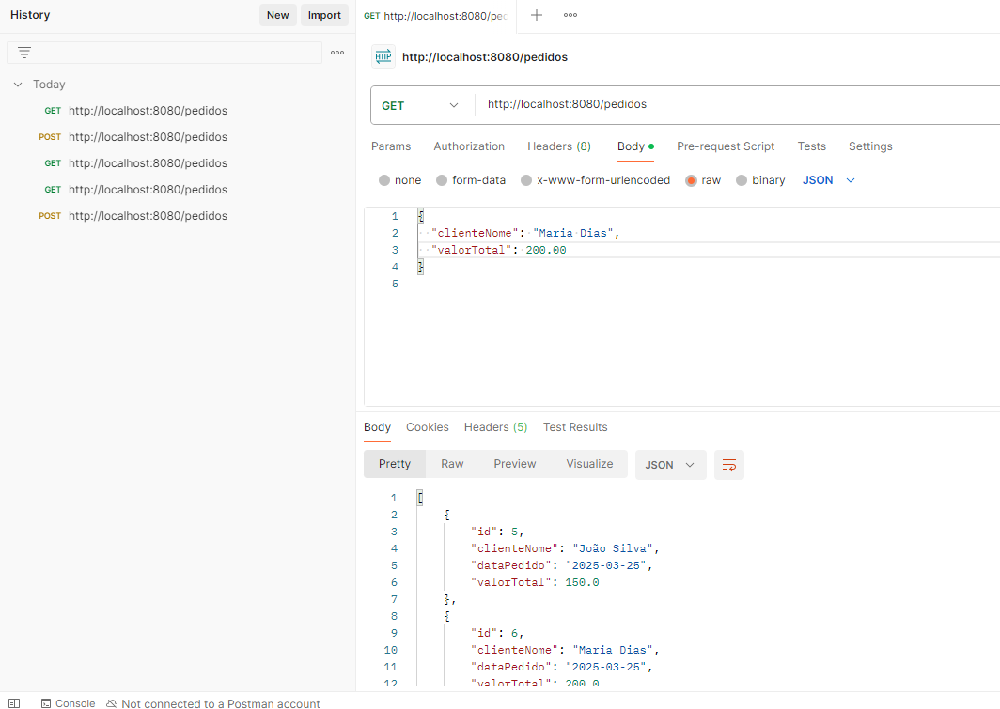
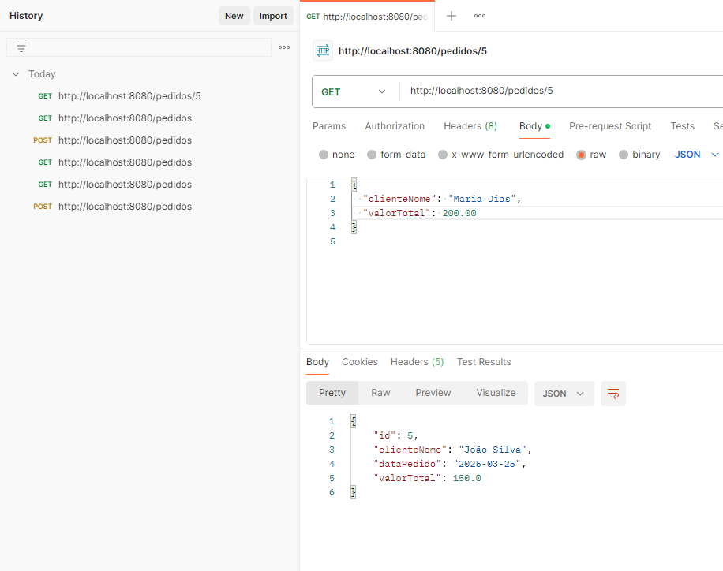
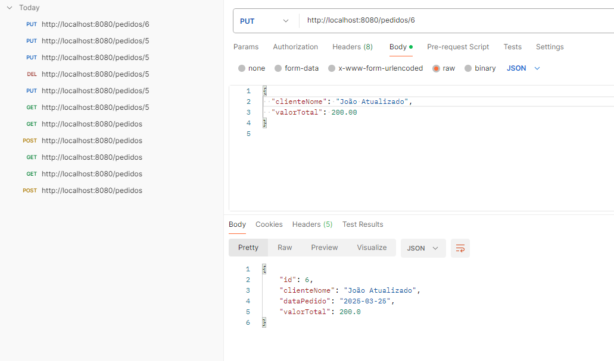
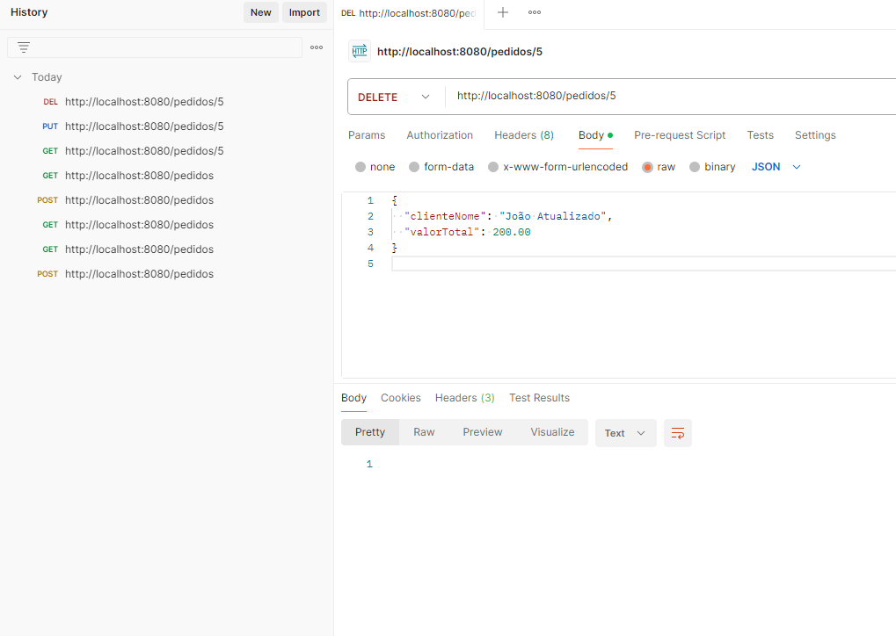

```markdown
# 🎯 **Checkpoint 1 - API de Pedidos**

Este projeto implementa uma **API REST** para o gerenciamento de pedidos, utilizando **Spring Boot**, **Spring Data JPA**, e o banco de dados **H2**.

---

## 🛠 **Tecnologias Empregadas**

- 🚀 **Java 17**
- ⚙️ **Spring Boot 3.1.x**
- 🌐 **Spring Web**
- 🔄 **Spring Boot DevTools**
- ✍️ **Lombok**
- 🗄 **Spring Data JPA**
- 🛢 **H2 Database**
- 📦 **Maven**

---

## 🚀 **Instruções para Rodar a Aplicação**

1. **Clone o repositório**:
   ```sh
   git clone https://github.com/jzampieri/fiap-checkpoint1.git
   cd fiap-checkpoint1
   ```

2. **Compile e baixe as dependências**:
   ```sh
   mvn clean install
   ```

3. **Execute a aplicação**:
   ```sh
   mvn spring-boot:run
   ```

4. **Acesse o console do H2 Database** (caso necessário):
   - 🔗 **URL:** `http://localhost:8080/h2-console`
   - 🛢 **JDBC URL:** `jdbc:h2:mem:testdb`
   - 👤 **Usuário:** `sa`
   - 🔑 **Senha:** *(deixe em branco)*

---

## 📌 **Endpoints da API**

### 📝 **Criar Pedido**
- **URL:** `POST /pedidos`
- **Corpo (JSON):**
  ```json
  {
    "clienteNome": "João Silva",
    "valorTotal": 150.00
  }
  ```
- **Resposta:**
  ```json
  {
    "id": 1,
    "clienteNome": "João Silva",
    "dataPedido": "2025-03-25",
    "valorTotal": 150.00
  }
  ```

  
!   [alt text](image-1.png)

### 📋 **Listar Todos os Pedidos**
- **URL:** `GET /pedidos`
- **Resposta:**
  ```json
  [
    {
      "id": 1,
      "clienteNome": "João Silva",
      "dataPedido": "2025-03-25",
      "valorTotal": 150.00
    }
  ]
  ```
  

### 🔍 **Buscar Pedido por ID**
- **URL:** `GET /pedidos/{id}`
- **Exemplo:** `GET /pedidos/1`



### ✏️ **Atualizar Pedido**
- **URL:** `PUT /pedidos/{id}`
- **Corpo (JSON):**
  ```json
  {
    "clienteNome": "João Atualizado",
    "valorTotal": 200.00
  }
  ```



### ❌ **Remover Pedido**
- **URL:** `DELETE /pedidos/{id}`
- **Exemplo:** `DELETE /pedidos/1`



---

## 🔬 **Testando a API**

Você pode utilizar as seguintes ferramentas para testar os endpoints da API:
- **📌 Postman**
- **📌 Insomnia**
- **📌 cURL**
```